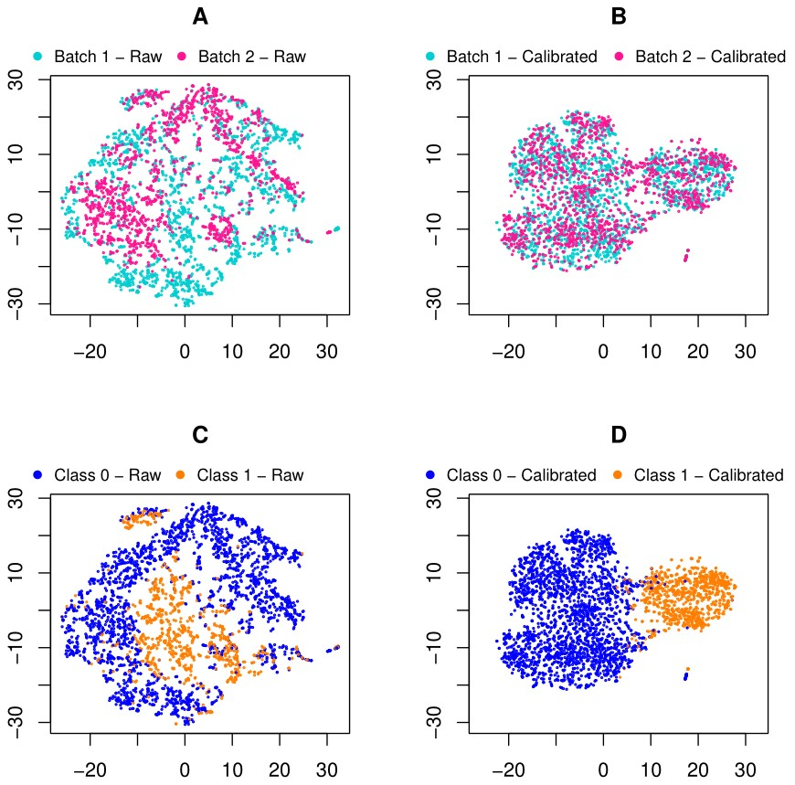
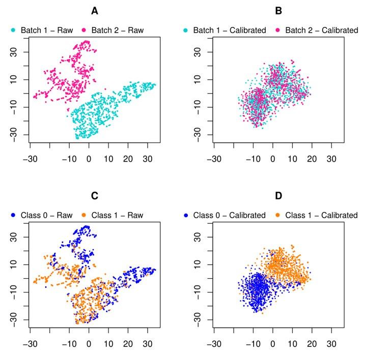

# JDLBER
Joint Deep Learning for Batch Effect Removal and Classification Based on Metabolomics

Codes and data for using our method, a novel end-to-end deep learning framework for improving diagnostic accuracy by batch-effect calibration in metabolomics data.

##Abstract
Metabolomics occupies an important position in both clinical diagnosis performance and basic researches for metabolic signatures and biomarkers. These technologies used in biology depend on a complicated set of reagents and hardware. However, batch effects may occur if two technicians are responsible for different subsets of the experiments or if two different lots of reagents, chips or instruments are used. If not properly dealt with, batch effects can have a particularly strong and pervasive impact, which subsequently leads to serious concerns about the validity of the biological conclusions.
To fully improve the accuracy of diagnosis for distinguishing between patients and healthy people better, it is necessary to remove the bias caused by the experimental environment. We present a novel end-to-end deep learning framework, which consists of three networks, namely calibrator network, reconstructor(s) and discriminator. The goal is to minimize the distance between the multivariate distributions of two replicates while guaranteeing biological information still exists and higher diagnosis accuracy. We demonstrate that our algorithm outperforms existing methods for removing batch effects in public CyTOF and private MALDI MS datasets.

## Data
Public CyTOF: CyTOF is a mass cytometry technology that allows simultaneous measurements of multiple biomarkers in each cell of a specimen. We perform our experiments on a subset of the publicly available data used in Uri Shaham. Peripheral Blood Mononuclear Cells (PBMCs) were collected from two sclerosis patients that were thawed in two batches (on two different days) and incubated with or without some kind of ionomycin marks. The data contains eight samples, belonging to two patients of two different periods respectively, where each period of each patient has two samples collected on different days on the same CyTOF machine. We can specify Day 1 of Patient 1 for training and Day 2 for testing, and so is Patient 2. All samples had dimension d = 25 and contained 1800-5000 cells each. 

Private MALDI MS: Another set of experiments were carried out based on the laser desorption/ionization mass spectrometry (LDI MS) detection results of serum samples. All the serum samples, including healthy controls and systemic lupus erythematosus (SLE) patients were collected according to standard procedures from RenJi hospital, School of Medicine, Shanghai Jiao Tong University. The SLE patients were diagnosed according to the criteria of 2012 Systemic Lupus International Collaborating Clinics (SLICC). And the healthy controls showed no symptoms of rheumatic disease or other disease. All the participants have provided the informed consents for this study.

## Method
We propose a joint deep learning framework to calibrate batch effect first and then conduct sample classification (e.g., to derive disease diagnosis). Our framework consists of three major branches: (1) a calibrator to minimize the dissimilarity between different batches; (2) reconstructor(s) to guarantee that the sample data can be fully recovered after calibrating batch effect, which assures the fidelity of data processing in our framework; and (3) a discriminator to predict the labels of samples given their calibrated data. Given individual input batches of metabolomics data, we pass them through the calibrator such that they are aligned in the latent feature space. A subsequent discriminator derives from the latent space, supervised by the known disease labels of certain batch(es) in training, and predicting diagnosis labels for the other test batch(es). The reconstructor(s), which also derives from the latent feature space, ensures all batches to be fully recovered. The loss function we optimized contains three components: the reconstruction loss between the input and output of the encoder-decoder backbone, the MMD-based loss between the codes of two batches, and classification loss between predictions and true labels. Our framework is shown in figure below.

## Results
We apply the proposed method to two applications of CyTOF and MALDI MS, respectively, and demonstrate superior performance in achieving not only good batch effect removal but also satisfactory classification capability. 
Results for public CyTOF: 

Results for private MALDI MS:

## Dependencies
Python 3.6.8
PyTorch 1.3.1
Sklearn 0.21.3
R 3.6.3

## Files
*computeAcc.py*: An example of training label known dataset and computing accuracy on label unknown dataset going through batch effect removal
*classify.py*: An example of training label known dataset and computing accuracy on label unknown dataset without any treatment
*crossValidation.py*: 10 fold cross validation in “Subject” level and “Sample” level to request the upper bound of prediction
*network.py*: Class definitions for three network architectures (Calibrator, Reconstructors, Discriminator) and loss function
*pre_processing.py*: Data preprocessing
*mmd.py*: Definition of maximum mean discrepancy (MMD)
*auxiliary.py*: Some functions that implement visualization
*alignment.py*: Peak alignment to ensure consistent number of
features

## Run our codes
1. To carry out peak alignment, run the script below:
 	python alignment.py --data_path your_data_path --target target_file --source source_file
2. To conduct 10 fold cross validation at both levels:
    python  crossValidation.py --data_folder your_data_path –train_file   data_file –sample_count sample_count_file 
3. View diagnosis results before batch effect calibration:
   python classify.py --data_folder your_data_path --dataset_file_list file1 file2 (file3) –sample_count sample_count_file
4. View diagnosis results after batch effect calibration:
 python computeAcc.py --data_folder your_data_path --dataset_file_list file1 file2 (file3) –sample_count sample_count_file

## Citation
If you find this work useful for your research, please consider citing:
@article{Niu2020Joint,
author={Jingyang Niu, Qian Wang, Jing Yang, Kun Qian},
title={Joint Deep Learning for Batch Effect Removal and Classification Based on Metabolomics},
journal={Bioinfomatics},
year={2020}
}
