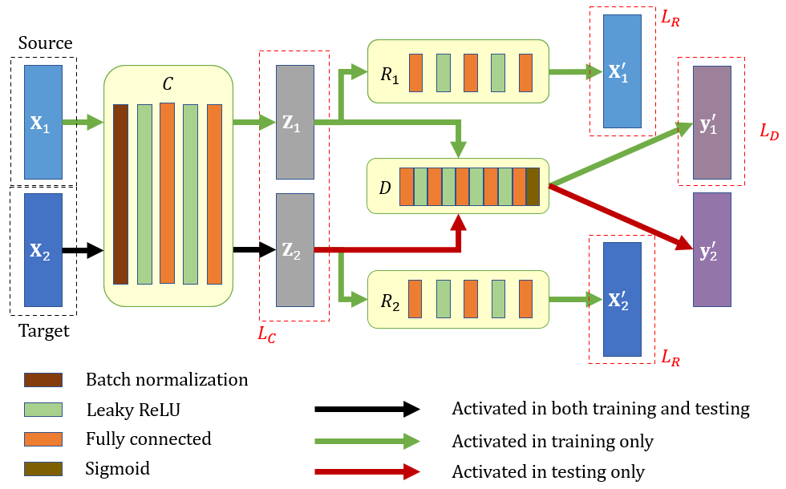
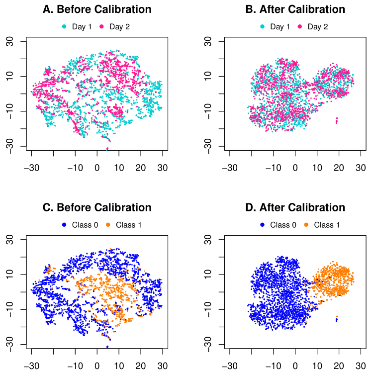
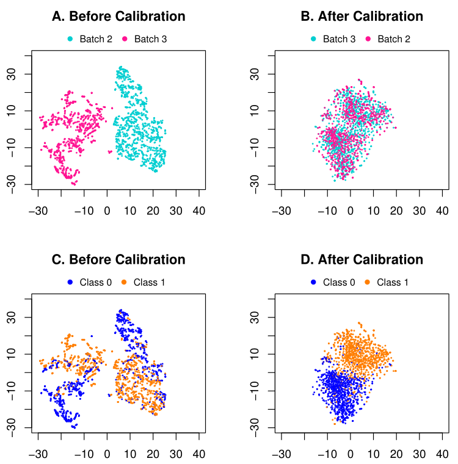

# JDLBER
## Joint Deep Learning for Batch Effect Removal and Classification Based on Metabolomics

Codes and data for using our method, a novel end-to-end deep learning framework for improving diagnostic accuracy by batch-effect calibration in metabolomics data.

## Abstract
Metabolomics occupies an important position in both clinical diagnosis performance and basic researches for metabolic signatures and biomarkers. However, batch effects may occur if two technicians are responsible for different subsets of the experiments or if two different lots of reagents, chips or instruments are used. If not properly dealt with, batch effects can subsequently leads to serious concerns about the validity of the biological conclusions. 
To fully improve the accuracy of diagnosis for distinguishing between patients and healthy people better, it is necessary to remove the bias caused by the experimental environment. We present a novel end-to-end deep learning framework, which consists of three networks, namely calibrator network, reconstructor(s) and discriminator. We demonstrate that our algorithm outperforms existing methods for removing batch effects in public CyTOF and private MALDI MS datasets.

## Data
**Public CyTOF:** CyTOF is a mass cytometry technology that allows simultaneous measurements of multiple biomarkers in each cell of a specimen. We perform our experiments on a subset of the publicly available data used in Uri Shaham. Peripheral Blood Mononuclear Cells (PBMCs) were collected from two sclerosis patients that were thawed in two batches (on two different days) and incubated with or without some kind of ionomycin marks. All samples had dimension d = 25 and contained 1400-5000 cells each. 

**Private MALDI MS:** Another set of experiments were carried out based on the laser desorption/ionization mass spectrometry (LDI MS) detection results of serum samples. All the serum samples, including healthy controls and systemic lupus erythematosus (SLE) patients were collected according to standard procedures from RenJi hospital, School of Medicine, Shanghai Jiao Tong University. 

## Method
We propose a joint deep learning framework to calibrate batch effect first and then conduct sample classification (e.g., to derive disease diagnosis). Our framework consists of three major branches: (1) a calibrator to minimize the dissimilarity between different batches; (2) reconstructor(s) to guarantee that the sample data can be fully recovered after calibrating batch effect, which assures the fidelity of data processing in our framework; and (3) a discriminator to predict the labels of samples given their calibrated data. The loss function we optimized contains three components: the reconstruction loss between the input and output of the encoder-decoder backbone, the MMD-based loss between the codes of two batches, and classification loss between predictions and true labels. Our framework is shown in figure below.

## Results
We apply the proposed method to two applications of CyTOF and MALDI MS, respectively, and demonstrate superior performance in achieving not only good batch effect removal but also satisfactory classification capability. 
Results for public CyTOF: 

Results for private MALDI MS:

## Dependencies
Python 3.6.8 
PyTorch 1.3.1 
Sklearn 0.21.3 
R 3.6.3 

## Files
*after_calib.py*: An example of training label known dataset and computing four matrics on label unknown dataset after batch effect removal 
*before_calib.py*: An example of training label known dataset and computing four matrics on label unknown dataset before calibration 
*crossValidation.py*: 10 fold cross validation in “Subject” level and “Sample” level to request the upper bound of cross-batch prediction 
*network.py*: Class definitions for three network architectures (Calibrator, Reconstructors, Discriminator) and loss function 
*function.py*: Data preprocessing, definition of MMD and some functions that implement visualization 
*alignment.py*: Peak alignment to ensure consistent number of features 

## Run our codes
1. Clone this git repository 
   git clone https://github.com/n778509775/JDLBER.git 
   and install all the requirements listed above. Our operating environment is Ubuntu 16.04. You should install all packages required by the program as follows： 
   sudo pip3 install package_name 
   If only available for this user, please follow: 
   pip3 install package_name --user 
2. The dataset is organized in the data folder: 
   "1.csv", "2.csv", "3.csv" are representing three batches of the MALDI MS data, and "sample-num-1", "sample-num-2", "sample-num-3" store the number of samples corresponding to    each subject in the corresponding file. 
   "Person1Day1_baseline.csv", "Person1Day2_baseline.csv", "Person2Day1_baseline.csv", "Person2Day2_baseline.csv" are coming from public CyTOF data. "Day 1" and "Day 2" herald      different batches. 
3. Fortunately, although our original collected sample data are not public, the preprocessed version is shared in the data folder. This version has conducted feature matching,      that is, the number of features of the same data type is equal. 
   If the number of features you are processing is not equal, please carry out peak alignment and run the script below: 
 	python alignment.py --data_path your_data_path --target target_file --source source_file 
4. In order to obtain the upper bound of cross-validation, we could conduct 10 fold in-batch cross validation at both sample and subject levels: 
    python crossValidation.py --data_folder your_data_path --train_file data_file   
    example：python crossValidation.py --train_file Person1Day1_baseline.csv --num_epochs 20  
3. View diagnosis results before batch effect calibration:
   python before_calib.py --data_folder your_data_path --train_file file1 --test_file file2  
   example：
4. View diagnosis results after batch effect calibration:
 python after_calib.py --data_folder your_data_path --train_file file1 --test_file file2  
 example：

## Citation
If you find this work useful for your research, please consider citing our article.
